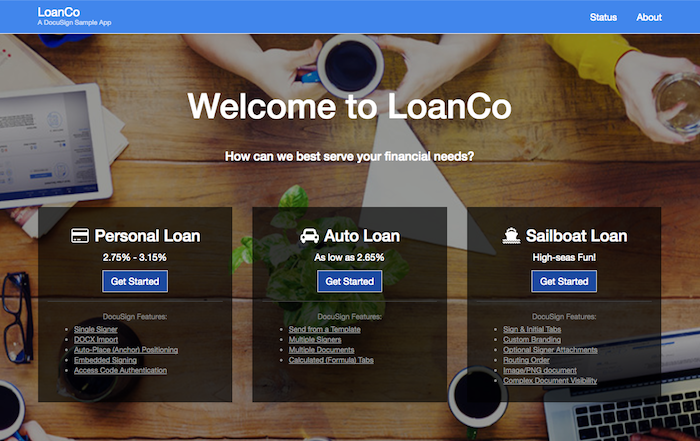

# The Official DocuSign Node Client 

[![NPM version][npm-image]][npm-url]
[![NPM downloads][downloads-image]][downloads-url]
[![Build status][travis-image]][travis-url]
[![bitHound Overall Score][bitHound-image]][bitHound-url]
[![Coverage Status][coveralls-image]][coveralls-url]

[NPM module](https://www.npmjs.com/package/docusign-esign) that wraps the <a href="https://www.docusign.com">DocuSign</a> API

[Documentation about the DocuSign API](https://www.docusign.com/developer-center)

[Documentation about this package](http://docusign.github.io/docusign-node-client)
<!---
[Changelog](./CHANGELOG.md)
commented out
-->

You can sign up for a free [developer sandbox](https://www.docusign.com/developer-center).

Requirements
============

Node 4 or later.

Installation
============

### NPM Package Manager

Install the client locally:  `npm install docusign-esign --save --save-exact` (note you may have to use `sudo` based on your permissions)

Alternatively you can just copy the source code directly into your project.

#### Dependencies

This client has the following external dependencies:
* jsonwebtoken@7.4.1
* passport-oauth2@1.4.0
* superagent@3.8.2

Usage
=====

To initialize the client, make the Login API Call and send a template for signature:
### SDK version 3.x.x

### OAuth Authorization Code Grant
uncomment auth code grant section in test/OAuthClientTests.js, run it and then open http://localhost:3000.
```javascript
const express = require('express');
const docusign = require('../src/index');
const apiClient = new docusign.ApiClient();

const app = express();
const port = process.env.PORT || 3000;
const host = process.env.HOST || 'localhost';

const integratorKey = 'ae30ea4e-XXXX-XXXX-XXXX-Xcb57d2dc4df'; // An IK for a non-mobile docusign account
const clientSecret = 'b4dccdbe-XXXX-XXXX-XXXX-X2f0f7448f8f';
const redirectUri = 'http://localhost:3000/auth'; // This needs to be registered with the integrator key in your admin account
const basePath = 'https://demo.docusign.net/restapi';

const responseType = apiClient.OAuth.ResponseType.CODE; // Response type of code, to be used for the Auth code grant
const scopes = [apiClient.OAuth.Scope.EXTENDED];
const randomState = "*^.$DGj*)+}Jk"; // after successful login you should compare the value of URI decoded "state" query param with the one created here. They should match

apiClient.setBasePath(basePath);

app.get('/', function (req, res) {
    const authUri = apiClient.getAuthorizationUri(integratorKey, scopes, redirectUri, responseType, randomState);//get DocuSign OAuth authorization url
     //Open DocuSign OAuth login in a browser, res being your node.js response object.
    res.redirect(authUri);
});

app.get('/auth', function (req, res) {
  // IMPORTANT: after the login, DocuSign will send back a fresh
  // authorization code as a query param of the redirect URI.
  // You should set up a route that handles the redirect call to get
  // that code and pass it to token endpoint as shown in the next
  // lines:
  apiClient.generateAccessToken(integratorKey, clientSecret, req.query.code, function (err, oAuthToken) {

    console.log(oAuthToken);

    apiClient.getUserInfo(oAuthToken.accessToken, function (err, userInfo) {
      console.log("UserInfo: " + userInfo);
      // parse first account's baseUrl
      // below code required for production, no effect in demo (same
      // domain)
      apiClient.setBasePath(userInfo.accounts[0].baseUri + "/restapi");
      res.send(userInfo);
    });
  });
});

app.listen(port, host, function (err) {
  if (err)
    throw err;

  console.log('Your server is running on http://' + host + ':' + port + '.');
});

```
#### OAuth Implicit Grant

uncomment implicit grant section in test/OAuthClientTests.js, run it and then open http://localhost:3000.
```javascript

const express = require('express');
const docusign = require('../src/index');
const apiClient = new docusign.ApiClient();

const app = express();
const port = process.env.PORT || 3000;
const host = process.env.HOST || 'localhost';

const integratorKey = '68c1711f-XXXX-XXXX-XXXX-X49b4211d831'; // An IK for a mobile docusign account
const redirectUri = 'http://localhost:3000/auth';
const basePath = 'https://demo.docusign.net/restapi';

const responseType = apiClient.OAuth.ResponseType.TOKEN; // Response type of token, to be used for implicit grant
const scopes = [apiClient.OAuth.Scope.EXTENDED];
const randomState = "*^.$DGj*)+}Jk"; // after successful login you should compare the value of URI decoded "state" query param with the one created here. They should match

apiClient.setBasePath(basePath);

app.get('/', function (req, res) {
    const authUri = apiClient.getAuthorizationUri(integratorKey, scopes, redirectUri, responseType, randomState);//get DocuSign OAuth authorization url
     //Open DocuSign OAuth login in a browser, res being your node.js response object.
    res.redirect(authUri);
});

app.get('/auth', function (req,res) {
  // IMPORTANT: after the login, DocuSign will send back a new
  // access token in the hash fragment of the redirect URI.
  // You should set up a client-side handler that handles window.location change to get
  // that token and pass it to the ApiClient object as shown in the next
  // lines:
  res.send();
});

app.get('/auth/:accessToken', function (req, res) {
  // This a sample endpoint to allow you to pass in the previously recEIved accesstoken to log in via getUserInfo
  // ex: http://localhost:3000/auth#access_token=<token>&expires_in=<expiresIn>&token_type=<tokenType>&state=<randomState>
  // ex: http://localhost:3000/auth/<token>

  const accessToken = req.params.accessToken;

  apiClient.getUserInfo(accessToken, function (err, userInfo) {
    if (err)
      console.log(err)

    console.log("UserInfo: " + userInfo);
    // parse first account's baseUrl
    // below code required for production, no effect in demo (same
    // domain)
    apiClient.setBasePath(userInfo.accounts[0].baseUri + "/restapi");
    res.send(userInfo);
  });
});

app.listen(port, host, function(err) {
  if (err)
    throw err;

  console.log('Your server is running on http://' + host + ':' + port + '.');
});
    
```
#### Using DocuSign passport-based Oauth Client for Express	

```javascript
const express = require('express');
const passport = require('passport');
var session = require('express-session');
var docusign = require('../src/index');

const app = express();
const port = process.env.PORT || 3000;
const host = process.env.HOST || 'localhost';

app.use(session({
  secret: 'secret token',
  resave: true,
  saveUninitialized: true
}));

app.use(passport.initialize());
app.use(passport.session());

var hostUrl = 'http://' + host + ':' + port;

// Configure Passport
passport.use(new docusign.OAuthClient({
  sandbox: true,
  clientID: 'YOUR_CLIENT_ID',
  clientSecret: 'YOUR_CLIENT_SECRET',
  callbackURL: hostUrl + '/auth/callback'
},
  function (accessToken, refreshToken, user, done) {
    // Here we're just assigning the tokens to the user profile object but we
    // could be using session storage or any other form of transient-ish storage
    user.accessToken = accessToken;
    user.refreshToken = refreshToken;
    return done(null, user);
  }
));

app.get('/auth', function (req, res) {
  passport.authenticate('docusign'/*, {state: 'optional state'}*/)(req, res);
});

app.get('/auth/callback', function (req, res) {
  passport.authenticate('docusign'/*, {state: 'optional state'}*/, function (err, user) {
    if (err) {
      return res.send(err);
    }
    if (!user) {
      return res.redirect('/auth');
    }

    // getting the API client ready
    var apiClient = new docusign.ApiClient();
    // for production environment update to "www.docusign.net/restapi"
    var BaseUrl = 'https://demo.docusign.net/restapi';
    apiClient.setBasePath(BaseUrl);
    apiClient.addDefaultHeader('Authorization', 'Bearer ' + user.accessToken);

    // making login call. we could also use DocuSign OAuth userinfo call
    apiClient.getUserInfo(user.access_token, function (error, userInfo) {
      if (error) {
        return res.send(error);
      }
      if (userInfo) {
        // list of user account(s)
        // note that a given user may be a member of multiple accounts
        var loginAccounts = userInfo.accounts;
        var loginAccount = loginAccounts[0];
        var baseUri = loginAccount.baseUri;
        var accountDomain = baseUri.split('/v2');

        // below code required for production, no effect in demo (same domain)
        apiClient.setBasePath(accountDomain[0] + '/restapi');
        docusign.Configuration.default.setDefaultApiClient(apiClient);

        // return the list of accounts to the browser
        return res.send(loginAccounts);
      }
    });
  })(req, res);
});

app.listen(port, host, function (err) {
  if (err) {
    throw err;
  }

  console.log('Your server is running on http://' + host + ':' + port + '.');
});


````

#### Using 2-legged authentication
Run this script using node command
```javascript
var docusign = require('docusign-esign');
var async = require('async');
var path = require('path');

var integratorKey = '***';                    // Integrator Key associated with your DocuSign Integration
var email = 'YOUR_EMAIL';                     // Email for your DocuSign Account
var password = 'YOUR_PASSWORD';               // Password for your DocuSign Account
var docusignEnv = 'demo';                     // DocuSign Environment generally demo for testing purposes
var fullName = 'Joan Jett';                   // Recipient's Full Name
var recipientEmail = 'joan.jett@example.com'; // Recipient's Email
var templateId = '***';                       // ID of the Template you want to create the Envelope with
var templateRoleName = '***';                 // Role Name of the Template

var baseUrl = 'https://' + docusignEnv + '.docusign.net/restapi';
var userId = 'YOUR_USER_ID';
var oAuthBaseUrl = 'account-d.docusign.com'; // use account.docusign.com for Live/Production
var redirectURI = 'https://www.docusign.com/api';
var privateKeyFilename = 'keys/docusign_private_key.txt';

var apiClient = new docusign.ApiClient();

async.waterfall([
  function initApiClient (next) {
    apiClient.setBasePath(baseUrl);
    // assign the api client to the Configuration object
    docusign.Configuration.default.setDefaultApiClient(apiClient);

    // IMPORTANT NOTE:
    // the first time you ask for a JWT access token, you should grant access by making the following call
    // get DocuSign OAuth authorization url:
    var oauthLoginUrl = apiClient.getJWTUri(integratorKey, redirectURI, oAuthBaseUrl);
    // open DocuSign OAuth authorization url in the browser, login and grant access
    console.log(oauthLoginUrl);
    // END OF NOTE

    // configure the ApiClient to asynchronously get an access to token and store it

    apiClient.configureJWTAuthorizationFlow(path.resolve(__dirname, privateKeyFilename), oAuthBaseUrl, integratorKey, userId, 3600, function (err, res) {
      if (!err && res.body && res.body.access_token) {
        apiClient.getUserInfo(res.body.access_token, function (err, userInfo) {
          accountId = userInfo.accounts[0].accountId;
          var baseUri = userInfo.accounts[0].baseUri;
          var accountDomain = baseUri.split('/v2');
          // below code required for production, no effect in demo (same domain)
          apiClient.setBasePath(accountDomain[0] + "/restapi");
          console.log('LoginInformation: ' + JSON.stringify(userInfo.accounts));

          next(null, userInfo.accounts[0]);
        });
      }
    });
  },

  function sendTemplate (loginAccount, next) {
    // create a new envelope object that we will manage the signature request through
    var envDef = new docusign.EnvelopeDefinition();
    envDef.emailSubject = 'Please sign this document sent from Node SDK';
    envDef.templateId = templateId;

    // create a template role with a valid templateId and roleName and assign signer info
    var tRole = new docusign.TemplateRole();
    tRole.roleName = templateRoleName;
    tRole.name = fullName;
    tRole.email = recipientEmail;

    // create a list of template roles and add our newly created role
    var templateRolesList = [];
    templateRolesList.push(tRole);

    // assign template role(s) to the envelope
    envDef.templateRoles = templateRolesList;

    // send the envelope by setting |status| to 'sent'. To save as a draft set to 'created'
    envDef.status = 'sent';

    // use the |accountId| we retrieved through the Login API to create the Envelope
    var accountId = loginAccount.accountId;

    // instantiate a new EnvelopesApi object
    var envelopesApi = new docusign.EnvelopesApi();

    // call the createEnvelope() API
    envelopesApi.createEnvelope(accountId, {'envelopeDefinition': envDef}, function (err, envelopeSummary, response) {
      if (err) {
        return next(err);
      }
      console.log('EnvelopeSummary: ' + JSON.stringify(envelopeSummary));
      next(null);
    });
  }

], function end (error) {
  if (error) {
    console.log('Error: ', error);
    process.exit(1);
  }
  process.exit();
});
```

### SDK version 2.x.x using 2-legged authentication only
Run this script using node command
```javascript
var docusign = require('docusign-esign');
var async = require('async');

var integratorKey = '***';                    // Integrator Key associated with your DocuSign Integration
var email = 'YOUR_EMAIL';                     // Email for your DocuSign Account
var password = 'YOUR_PASSWORD';               // Password for your DocuSign Account
var docusignEnv = 'demo';                     // DocuSign Environment generally demo for testing purposes
var fullName = 'Joan Jett';                   // Recipient's Full Name
var recipientEmail = 'joan.jett@example.com'; // Recipient's Email
var templateId = '***';                       // ID of the Template you want to create the Envelope with
var templateRoleName = '***';                 // Role Name of the Template

var baseUrl = 'https://' + docusignEnv + '.docusign.net/restapi';

// initialize the api client
var apiClient = new docusign.ApiClient();
apiClient.setBasePath(baseUrl);

// create JSON formatted auth header
var creds = JSON.stringify({
  Username: email,
  Password: password,
  IntegratorKey: integratorKey
});
apiClient.addDefaultHeader('X-DocuSign-Authentication', creds);

// assign api client to the Configuration object
docusign.Configuration.default.setDefaultApiClient(apiClient);

async.waterfall([
  function login (next) {
    // login call available off the AuthenticationApi
    var authApi = new docusign.AuthenticationApi();

    // login has some optional parameters we can set
    var loginOps = new authApi.LoginOptions();
    loginOps.setApiPassword('true');
    loginOps.setIncludeAccountIdGuid('true');
    authApi.login(loginOps, function (err, loginInfo, response) {
      if (err) {
        return next(err);
      }
      if (loginInfo) {
        // list of user account(s)
        // note that a given user may be a member of multiple accounts
        var loginAccounts = loginInfo.getLoginAccounts();
        console.log('LoginInformation: ' + JSON.stringify(loginAccounts));
        var loginAccount = loginAccounts[0];
        var accountId = loginAccount.accountId;
        var baseUrl = loginAccount.baseUrl;
        var accountDomain = baseUrl.split("/v2");

        // below code required for production, no effect in demo (same domain)
        apiClient.setBasePath(accountDomain[0]);
        docusign.Configuration.default.setDefaultApiClient(apiClient);
        next(null, loginAccount);
      }
    });
  },

  function sendTemplate (loginAccount, next) {
    // create a new envelope object that we will manage the signature request through
    var envDef = new docusign.EnvelopeDefinition();
    envDef.setEmailSubject('Please sign this document sent from Node SDK');
    envDef.setTemplateId(templateId);

    // create a template role with a valid templateId and roleName and assign signer info
    var tRole = new docusign.TemplateRole();
    tRole.setRoleName(templateRoleName);
    tRole.setName(fullName);
    tRole.setEmail(recipientEmail);

    // create a list of template roles and add our newly created role
    var templateRolesList = [];
    templateRolesList.push(tRole);

    // assign template role(s) to the envelope
    envDef.setTemplateRoles(templateRolesList);

    // send the envelope by setting |status| to 'sent'. To save as a draft set to 'created'
    envDef.setStatus('sent');

    // use the |accountId| we retrieved through the Login API to create the Envelope
    var accountId = loginAccount.accountId;

    // instantiate a new EnvelopesApi object
    var envelopesApi = new docusign.EnvelopesApi();

    // call the createEnvelope() API
    envelopesApi.createEnvelope(accountId, envDef, null, function (err, envelopeSummary, response) {
      if (err) {
        return next(err);
      }
      console.log('EnvelopeSummary: ' + JSON.stringify(envelopeSummary));
      next(null);
    });
  }

], function end (error) {
  if (error) {
    console.log('Error: ', error);
    process.exit(1);
  }
  process.exit();
});

```

See [CoreRecipes.js](./test/Recipes/CoreRecipes.js) for more examples.

Sample App
=======

Check out the LoanCo sample app - an open source app that showcases the Node.js SDK and demonstrates several common DocuSign workflows and features:

Run the app:  https://loancosample.docusign.com/

Get the code:  https://github.com/docusign/sample-app-loanco-nodejs




# Authentication

## Service Integrations that use Legacy Header Authentication

([Legacy Header Authentication](https://docs.docusign.com/esign/guide/authentication/legacy_auth.html) uses the X-DocuSign-Authentication header.)

1. Use the [Authentication: login method](https://docs.docusign.com/esign/restapi/Authentication/Authentication/login/) to retrieve the account number **and the baseUrl** for the account.
The url for the login method is www.docusign.net for production and demo.docusign.net for the developer sandbox.
The `baseUrl` field is part of the `loginAccount` object. See the [docs and the loginAccount object](https://docs.docusign.com/esign/restapi/Authentication/Authentication/login/#/definitions/loginAccount)
2. The baseUrl for the selected account, in production, will start with na1, na2, na3, eu1, or something else. Use the baseUrl that is returned to create the *basePath* (see the next step.) Use the basePath for all of your subsequent API calls.
3. As returned by login method, the baseUrl includes the API version and account id. Split the string to obtain the *basePath*, just the server name and api name. Eg, you will receive `https://na1.docusign.net/restapi/v2/accounts/123123123`. You want just `https://na1.docusign.net/restapi` 
4. Instantiate the SDK using the basePath. Eg `ApiClient apiClient = new ApiClient(basePath);`
5. Set the authentication header as shown in the examples by using `Configuration.Default.AddDefaultHeader`

## User Applications that use OAuth Authentication
1. After obtaining a Bearer token, call the [OAuth: Userinfo method](https://docs.docusign.com/esign/guide/authentication/userinfo.html). Obtain the selected account's `base_uri` (server name) field.
The url for the Userinfo method is account-d.docusign.com for the demo/developer environment, and account.docusign.com for the production environment.
1. Combine the base_uri with "/restapi" to create the basePath. The base_uri will start with na1, na2, na3, eu1, or something else. Use the basePath for your subsequent API calls.
4. Instantiate the SDK using the basePath. Eg `ApiClient apiClient = new ApiClient(basePath);`
5. Create the `authentication_value` by combining the `token_type` and `access_token` fields you receive from either an [Authorization Code Grant](https://docs.docusign.com/esign/guide/authentication/oa2_auth_code.html) or [Implicit Grant](https://docs.docusign.com/esign/guide/authentication/oa2_implicit.html) OAuth flow. 
5. Set the authentication header by using `Configuration.Default.AddDefaultHeader('Authorization', authentication_value)`

Testing
=======

Unit tests are available in the [Test](https://github.com/docusign/docusign-node-client/tree/master/test) folder.

Contributing
============

**This SDK is auto-generated from OpenAPI specification file. For that reason, we actually do NOT accept pull requests. If you find a bug or have an idea that you want to see in the SDK, please open a new [issue](https://github.com/docusign/docusign-node-client/issues/new).**

Support
=======

Feel free to log issues against this client through GitHub.  We also have an active developer community on Stack Overflow, search the [DocuSignAPI](http://stackoverflow.com/questions/tagged/docusignapi) tag.

License
=======

The DocuSign Node Client is licensed under the following [License](LICENSE).


[npm-image]: https://img.shields.io/npm/v/docusign-esign.svg?style=flat
[npm-url]: https://npmjs.org/package/docusign-esign
[downloads-image]: https://img.shields.io/npm/dm/docusign-esign.svg?style=flat
[downloads-url]: https://npmjs.org/package/docusign-esign
[travis-image]: https://img.shields.io/travis/docusign/docusign-node-client.svg?style=flat
[travis-url]: https://travis-ci.org/docusign/docusign-node-client
[bitHound-image]: https://www.bithound.io/github/docusign/docusign-node-client/badges/score.svg
[bitHound-url]: https://www.bithound.io/github/docusign/docusign-node-client
[coveralls-image]: https://coveralls.io/repos/github/docusign/DocuSign-Node-Client/badge.svg?branch=master
[coveralls-url]: https://coveralls.io/github/docusign/DocuSign-Node-Client?branch=master
